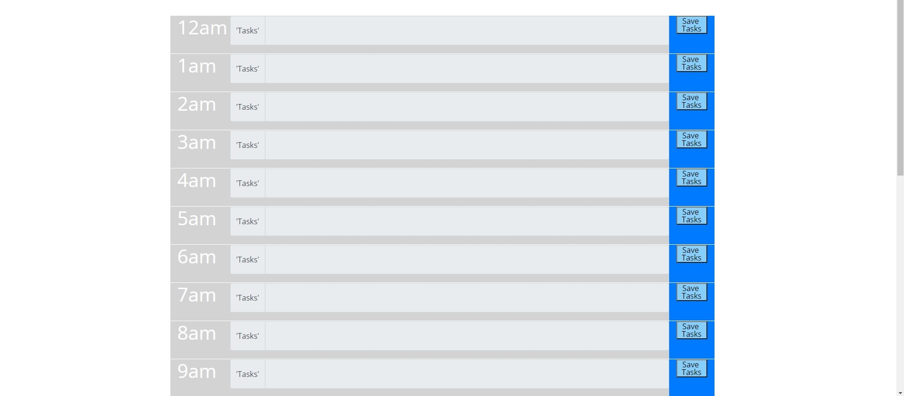

# Work Day Scheduler 

#Purpose: A simple scheduling app for planning out your workday via all 24 hours and text input that is saved to local storage and persists when you reload the page. 

Features: 
- Color changes to indicate past, future, or present times. 
- Is aware of what time/day it is. 
- Text input field for tasks
- Sleek UI
- Easy to use and understand
Link to deployed application: https://primitivej.github.io/Workday-Schedulatorv1.0/
#developed by 
Christopher J. Hoke AKA James Primitive 
in March of 2022. 
#Release: March 2022

